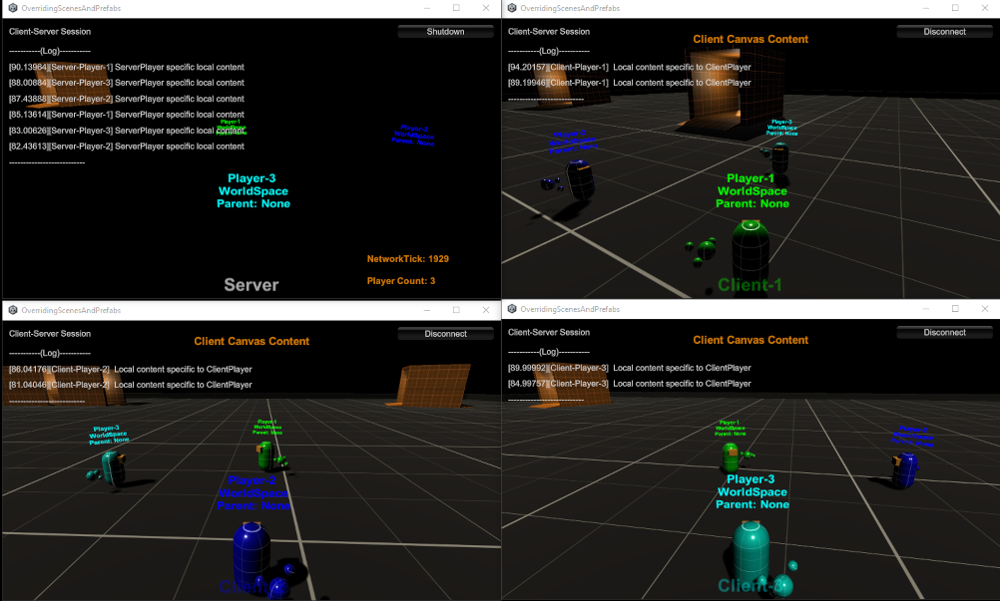
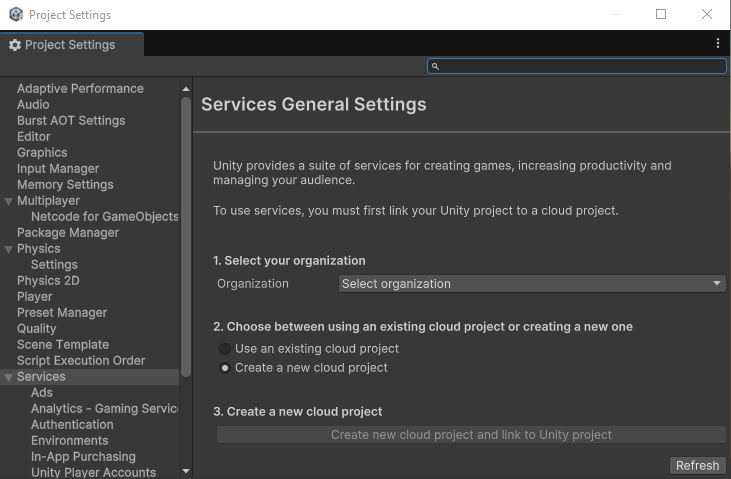
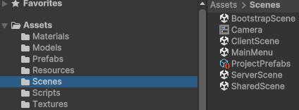
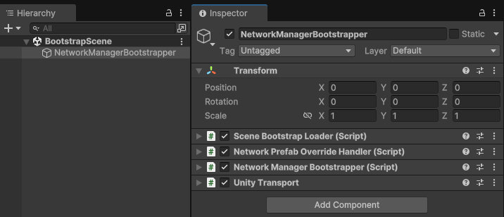
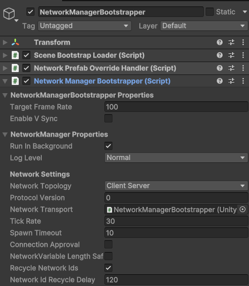
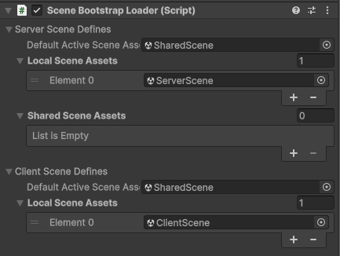
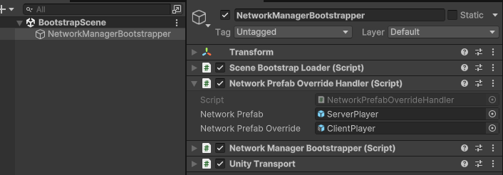

# Netcode for GameObjects   Overriding Scenes and NetworkPrefabs

_Supports using the client-server and distributed authority network topologies._

This example, based on the [Netcode for GameObjects Smooth Transform Space Transitions](https://github.com/Unity-Technologies/com.unity.netcode.gameobjects/tree/example/server-client-unique-scenes-and-prefabs/Examples/CharacterControllerMovingBodies), provides and overview of how to use:
- [`NetworkPrefabHandler`](https://docs.unity3d.com/Packages/com.unity.netcode.gameobjects@2.0/api/Unity.Netcode.NetworkPrefabHandler.html) as a way to dynamically control overriding network prefabs and how they are instantiated.
  - For this example, the prefab handler is overriding the player prefab. 
    - *You will only see the end result of this portion of the example by running a server instance (i.e. not host) as that will create instances of the ServerPlayer network prefab instead of the ClientPlayer network prefab.*
- [`NetworkSceneManager.SetClientSynchronizationMode`](https://docs.unity3d.com/Packages/com.unity.netcode.gameobjects@2.0/api/Unity.Netcode.NetworkSceneManager.html#Unity_Netcode_NetworkSceneManager_SetClientSynchronizationMode_UnityEngine_SceneManagement_LoadSceneMode_) to change the default client synchronization mode (SingleMode) to an additive client synchronization mode. 
  - Additive client synchronization mode will prevent already existing preloaded scenes from being unloaded and will use them, as opposed to reloading the same scene, during a client's initial synchronization. 
    - *This is a server-side only setting that gets sent to the clients during the initial synchronization process.*
- [`NetworkSceneManager.VerifySceneBeforeLoading`](https://docs.unity3d.com/Packages/com.unity.netcode.gameobjects@2.0/api/Unity.Netcode.NetworkSceneManager.html#Unity_Netcode_NetworkSceneManager_VerifySceneBeforeLoading) in order to control what scenes the server will include when sending the synchronization message to newly connecting clients.

## Building The Project
This example uses unity services. Upon loading the project for the first time, you will want to set your organization and create a new cloud project. This is the only required setting to create stand alone builds for this project.

## Terminology

### Shared Scenes
These are scenes that will be synchronized between a server or session owner and used when a client runs through the initial synchronization process. 
- You can populate these scenes with in-scene placed or dynamically spawned NetworkObjects. 
- These scenes **must be** within the scenes in build list.

### Local Scenes
These are scenes that are always only local to the application instances (server or client) and will not be synchronized. 
- You should not populate these scenes with NetworkObjects. 
  -However, this example includes one of several ways you can associate a `MonoBehaviour` with a `NetworkBehaviour`. 
- These scenes can be dynamically created, included in the scenes in build list, or be an addressable loaded at some point prior to connecting or while connected to a session.

## Client Synchronization and Scene Validation
By combining these two scene management features, you can preload scenes:
- That should not be synchronized and/or are specific to the server or client side of a network session.
- That you know will be synchronized in order to reduce the client synchronization process.

This approach can be useful if you:
- Want to have server-side only content that is loaded only on a server.
- Want to load local scenes for UI purposes or content that you don't need to synchronize.
    - *This example separates the colliders of the scene geometry from the mesh filters and renderers. Clients are the only instances that load the graphics related scene assets. Both clients and server load a shared scene that contains in-scene placed NetworkObjects and the colliders for the "floor"*

[Read the documentation for more information about client synchronization mode.](https://docs-multiplayer.unity3d.com/netcode/current/basics/scenemanagement/client-synchronization-mode/)

### Note on Distributed Authority
Since a distributed authority network topology is designed to keep all clients synchronized enough with the SDK level states in order to allow for rapid session owner promotion, the most common design approach (relative to this example) is to have local client scenes and the scenes to be synchronized between clients. However, there could be edge case scenarios where perhaps you only want there to only ever be a single session owner and upon the session owner disconnecting all clients will disconnect themselves too. Under this type of design, it would be valid to have local "server-side" (i.e. session owner) scenes. This example implements this by default for example purposes only. If you want your project to use session owner promotion, then it is highly recommended to only use the have client-side local and shared scenes approach.

## The Bootstrap Loading Process

### BootstrapScene
The first scene loaded. Contains a `NetworkManagerBootstrapper` in-scene placed `GameObject`.

#### NetworkManager Bootstrapper (component)

Handles the pre-network session menu interface along with connect and disconnect events. Since it is derived from `NetworkManager`, it also defines the network session configuration (i.e. `NetworkConfig`). The `NetworkManagerBootstrapper` in-scene placed `GameObject` gets loaded into the DDOL scene automatically and will persist throughout the application life time. This derived class requires the `SceneBootstrapLoader` component.

#### Scene Bootstrap Loader (component)

This component handles preloading scenes for both the client(s) and server. Upon being started, the `NetworkManagerBootstrapper` component will invoke `SceneBootstrapLoader.LoadMainMenu` method that kicks off the scene preloading process. 
- **Default Active Scene Asset:** There is always an active scene. For this example, the default active scene is the same on both the client and server relative properties. *The active scene is always (and should always) be a "shared scene".*
  - This could represent a lobby or network session main menu (i.e. create or join session).
  - Both the client and the server preload this scene prior to starting a network session.
- **Local Scene Assets:** There could be times where you want to load scenes specific to the `NetworkManager` instance type (i.e. client, host, or server).
  - These scenes are not synchronized by a server (client-server) or session owner (distributed authority).
  - Having different locally loaded scenes is typically more common in a client-server network topology.
  - In a distributed authority network topology, it is more common to keep all scenes synchronized but you might want to load non-synchronized scenes (i.e. menu interface for settings etc).
- **Shared Scene Assets:** These scenes are synchronized by the server or session owner (depending upon network topology used).
  - This example only provides a server specific set of scene assets to load because you can always add those same scenes to the client-side locally loaded scenes.
    - If the server synchronizes any scenes from the share scene assets with a client that already has those scene loaded, then those locally loaded scenes on the client side will be used during synchronization.
    - Depending upon how many scenes you want to synchronize and/or how large one or more scenes are, preloading scenes can reduce synchronization time for clients.
The `NetworkManagerBootstrapper` uses the `SceneBootstrapLoader` component to start the creation or joining of a network session. The logical flow looks like:
- `NetworkManagerBootstrapper` invokes `SceneBootstrapLoader.StartSession` when you click one of the (very simple) main menu buttons and passes in the mode/type of `NetworkManager` to start.
- Based on the `NetworkManager` type being started, the `SceneBootstrapLoader` will then:
 - Load the default active scene using the `UnityEngine.SceneManagement.SceneManager`.
 - Load the local scenes using the `UnityEngine.SceneManagement.SceneManager`.
 - Then it will create or join a network session by either starting the `NetworkManager` or connecting to the sesssion via multiplayer services.
 - _Server or Session Owner only:_
   - If any, load the shared (i.e. synchronized) scene assets using the `NetworkSceneManager`

#### Network Prefab Override Handler (component)

This `MonoBehaviour` component implements the `INetworkPrefabInstanceHandler` interface and registers with the `NetworkManafer.PrefabHandler` when started. It contains two network prefab properties:
- Network Prefab: This is the network prefab that you want to override. In this example, it is what is used to spawn a server-side player prefab and is what is defined within the `NetworkManagerBootstrapper` component.
- Network Prefab Override: This is what is used to spawn a player prefab on the client-side.

At runtime the local `NetworkManager` instance is a client/host or server and will spawn either the ClientPlayer or ServerPlayer prefab. The `NetworkPrefabOverrideHandler` does not need to be a `NetworkBehaviour` and sometimes (especially for overriding the player prefab) it is better to register prefab handlers prior to starting the `NetworkManager`.

## Input Controls
The following is a list of the input controls used in this project:
### Clients Only
- `W,A,S,D`: Movement (forward, backward, turn left, turn right)
  - *Arrow keys can be used as well.*
- `SPACE`: Jumps
- `P`: Enable disable player name and information.
- `C`: Toggles the player child object movement (continuous or only when the player moves).

### Server Only
- `[,]`: Right and left bracket keys will follow spawned players.
- `Backspace`: Stop following a player.

## Example Limitations
This example is primarily to provide a starting point for anyone interested in exploring how to override (customize) the scene loading and/or prefab instantiation. It does not cover all possible use case scenarios. It is recommended to explore this example, modify it, and read the [Netcode for GameObjects documentation](https://docs-multiplayer.unity3d.com/netcode/current/about/) for more details.

